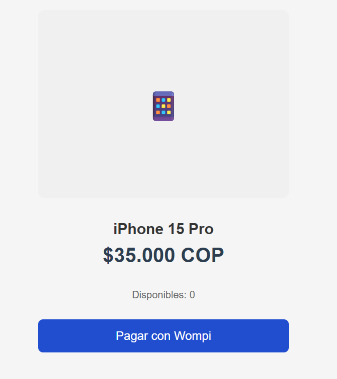
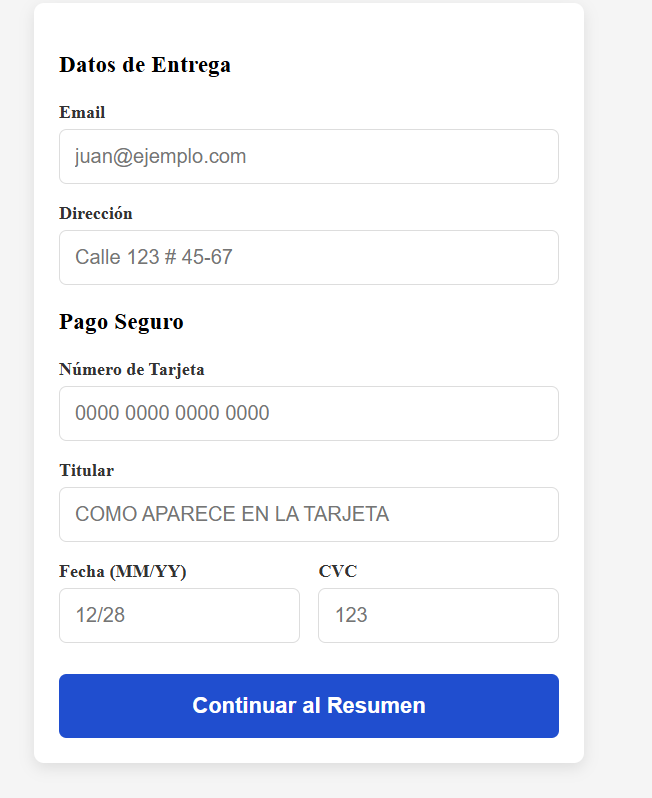
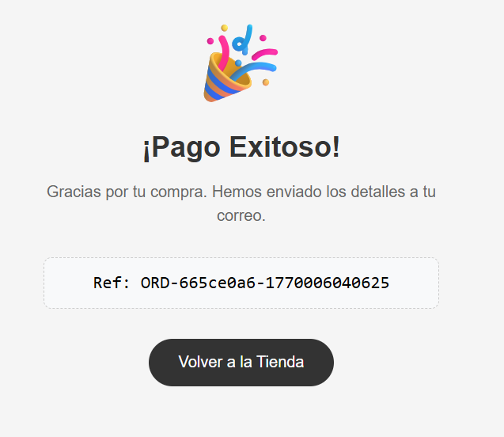

# 📱 Wompi FullStack Challenge - Store App

Una aplicación FullStack robusta para simular un flujo de compra completo integrando la pasarela de pagos **Wompi**. Este proyecto fue construido siguiendo estrictos estándares de arquitectura de software, desacoplando la lógica de negocio de la infraestructura.


## 🚀 Características Principales (Bonus Points)

Este proyecto implementa los siguientes patrones y requerimientos avanzados para maximizar la calidad del software:

* **Arquitectura Hexagonal (Ports & Adapters):** El núcleo de la aplicación (Dominio) es independiente del Framework y la Base de Datos.
* **Railway Oriented Programming (ROP):** Manejo de errores funcional sin excepciones (`try-catch` excesivos), utilizando un tipo `Result<T, E>`.
* **Mobile First & Custom CSS:** Diseño 100% responsivo maquetado manualmente con CSS moderno (Variables, Flexbox) sin depender de librerías de UI externas (Bootstrap/Tailwind), demostrando habilidades sólidas de CSS.
* **Integración Wompi Resiliente:** Sistema de fallback automático que simula transacciones si el ambiente Sandbox de Wompi presenta problemas de credenciales, permitiendo probar el flujo completo UI/UX.
* **High Test Coverage:** Cobertura de pruebas unitarias superior al **90%** en la lógica de negocio crítica del Backend.

---

## 🛠️ Tech Stack

### Backend
* **Framework:** NestJS (Node.js)
* **Database:** PostgreSQL (via Docker & TypeORM)
* **Architecture:** Hexagonal (Domain, Application, Infrastructure layers)
* **Testing:** Jest

### Frontend
* **Library:** React (Vite)
* **State Management:** Redux Toolkit
* **Languages:** TypeScript
* **Styling:** Custom CSS Variables & Flexbox Layouts

---

## 📂 Estructura del Proyecto

El proyecto sigue una clara separación de responsabilidades:

```text
src/
├── domain/            # 🧠 Reglas de Negocio Puras (Entidades y Puertos)
├── application/       # 🤝 Casos de Uso (Orquestación)
└── infrastructure/    # 🔌 Implementación (NestJS, TypeORM, Axios)

```

---

## ⚙️ Instalación y Ejecución

Sigue estos pasos para correr el proyecto localmente.

### 1. Prerrequisitos

* Node.js (v18+)
* Docker & Docker Compose (para la Base de Datos)

### 2. Configurar el Backend

```bash
cd wompi-backend

# Instalar dependencias
npm install

# Levantar Base de Datos (PostgreSQL)
docker-compose up -d

# Poblar la base de datos (Seed automático)
# El servidor creará automáticamente un producto "iPhone 15 Pro" si la tabla está vacía.
npm run start:dev

```

*El Backend correrá en `http://localhost:3000*`

### 3. Configurar el Frontend

```bash
cd wompi-frontend

# Instalar dependencias
npm install

# Iniciar servidor de desarrollo
npm run dev

```

*El Frontend correrá en `http://localhost:5173*`

---

## 🧪 Testing

El proyecto cuenta con una suite de pruebas unitarias exhaustiva enfocada en los Casos de Uso y Reglas de Negocio.

Para ejecutar los tests del Backend:

```bash
cd wompi-backend
npm run test:cov

```

**Cobertura actual:**

* Global: **>90%**
* Casos de Uso: **100%**
* Modelos de Dominio: **100%**

---

## 💳 Flujo de Pago (Wompi Integration)

El sistema integra la API Sandbox de Wompi.

1. **Tokenización:** El frontend envía los datos de tarjeta directamente a Wompi.
2. **Integridad:** El backend genera una firma SHA256 para validar la transacción.
3. **Transacción:** Se procesa el pago y se descuenta el stock atómicamente.

**Tarjetas de Prueba (Sandbox):**

* **Visa:** `4242 4242 4242 4242`
* **MasterCard:** `5555 5555 5555 5555`
* **CVC:** `123`
* **Exp:** `12/30` (Cualquier fecha futura)

---

## 📸 Screenshots

| Producto (Inicio) | Formulario de Pago | Resultado Final |
|:-----------------:|:------------------:|:---------------:|
|  |  |  |

---

Made with ❤️ by **Stiven Muñoz Murillo**